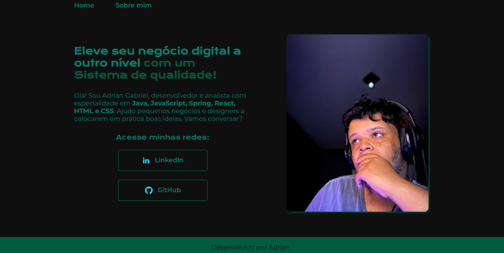

# Portólio: Aplicando Conhecimentos Básicos de HTML e CSS

Esse pequeno projeto foi feito para aplicar conceitos básicos de HMTL e CSS que foram estudados na [Alura](https://www.alura.com.br).  
Caso você esteja curioso, pode conferir o resultado clicando [nesse link](https://portfolio-hmtl-e-css.vercel.app/index.html).
